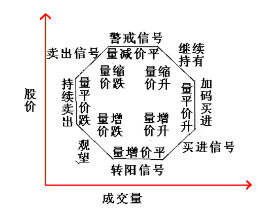

# 股票的基本理论

## 股票术语表

| 术语 | 常用缩写 | 英语 | 说明 |
| --- | --- | --- | --- |
| 成交股数 | Vol | Volumn | |
| 成交金额 | | AMOUNT | |
| 换手率 | TUN | | 股票每天成交量除以股票的流通总股本所得的比率。单位是“手”，一手为100股 |

## k 线图

## 成交量与股价的关系

美国的葛兰碧（Joe Granville）《股票市场指标》，提出“量价理论”。

核心思想：任何对股价的分析，如果离开了对成交量的分析，都将是无本之木，无水之源，因为成交量的增加或萎缩都表现出一定的股价趋势。

成交量和股价间也存在着八大规律：

1．量增价平：股价经过持续下跌进入到低位状态，出现了成交量增加但股价平稳的现象，此时不同天的成交量高度落差可能比较明显，这说明该股在底部积聚上涨动力。

2．量增价升：成交量在低价位区持续上升，同时伴随着股价上涨趋势，这说明股价上升得到了成交量的支撑，后市将继续看好，这是中短线的买入信号。

3．量平价升：在股价持续上涨的过程中，如果多日的成交量保持等量水平，建议在这一阶段中可以适当增加仓位。

4．量缩价升：成交量开始减少，但股价依然在上升，此时应该视情况继续持股。但如果还没有买入的投资者就不宜再重仓介入，因为股价已经有了一定的涨幅，价位开始接近上限。

5．量减价平：股价经长期大幅度上涨后，成交量显著减少，股价也开始横向调整不再上升，这是高位预警的信号。这个阶段里一旦有风吹草动，比如突然拉出大阳线和大阴线，建议应出货离场，做到落袋为安。

6．量缩价跌：成交量在高位继续减少，股价也开始进入下降通道，这是明确的卖出信号。如果还出现缩量阴跌，这说明股价底部尚远，不会轻易止跌。

7．量平价跌：成交量停止减少，但股价却出现急速下滑现象，这说明市场并没有形成一致看空的共识。股谚有“多头不死，跌势不止“的说法，出现“量平价跌”的情况，说明主力开始逐渐退出市场，这个阶段里，应继续观望或者出货，别轻易去买入以所谓的“抢反弹”。

8． 量增价跌：股价经长期大幅下跌之后，有可能出现成交量增加的情况，此时的操作原则是建议卖出，或者空仓观望。如果低价区成交量有增加，则说明有资金在此价位区间接盘，预示后期有望形成底部并出现反弹。但如果出现量增价跌，则建议应清仓出局。

## 葛兰碧均线八大买卖法则

1 移动平均线从下降逐渐转为平水平，且有超上方抬头迹象，而股价从均线下方突破时，为买进信号，如上图中的 1 点。
2 股价于移动平均线之上运行时下跌，但未跌破均线，此时股价再次上扬，此时为买入信号，如图中的 3 点。
3 股价位于均线上运行，下跌时破均线，但均线呈上升趋势，不久股价回到均线之上时，为买进信号，如图中的 2 点。
4 股价在均线下方运行时大跌，远离均线时向均线靠近，此时为买进时机，如图中的 4 点。
5 均线的上升趋势逐渐变平，且有向下迹象，而股价从均线上方向下穿均线，为卖出信号，如图中的 5 点。
6 股价向上穿过均线，不过均线依然保持下跌趋势，此后股价又下跌回均线下方，为卖出信号，如图中的 6 点。
7 股价运行在均线下方，出现上涨，但未过均线就再次下跌，此为卖出点，如图中的 7 点。
8 股价在均线的上方运行，连续上涨且继续远离均线，这种趋势说明随时会出现获利回吐的卖盘打压，此时是卖出的时机，如前图中的 8 点。
